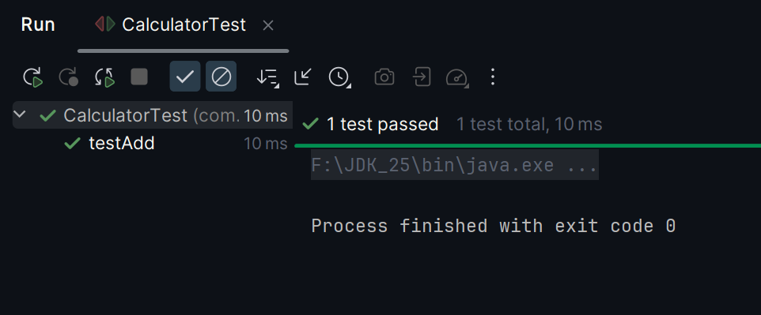

# Exercise 1: Setting Up JUnit

### Scenario:
- Set up JUnit in your Java project to start writing unit tests

### src:
- 🔗 [Calculator.java](./src/main/java/com/kunal/Calculator.java)
- 🔗 [CalculatorTest.java](./src/test/java/com/kunal/CalculatorTest.java)

### output:
- 