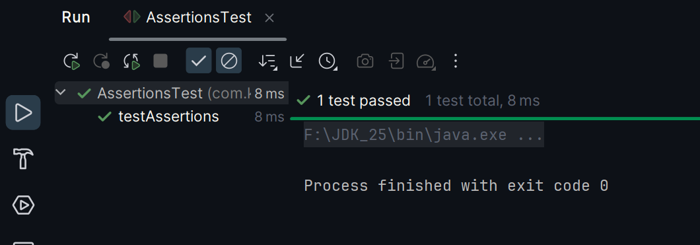

# Exercise 3: Assertions in JUnit

### Scenario:
- Use different assertions in JUnit to validate your test results.

### src:
- 🔗 [AssertionsTest.java](./src/test/java/com/kunal/AssertionsTest.java)

### output:
- 