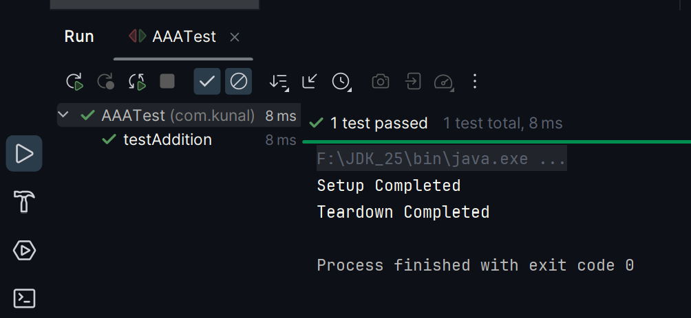

# Exercise 4: Arrange-Act-Assert (AAA) Pattern, Test Fixtures, Setup and Teardown Methods in JUnit

### Scenario:
- Organize your tests using the Arrange-Act-Assert (AAA) pattern and use setup
  and teardown methods.

### src:
- 🔗 [AAA Pattern Test.java](./src/test/java/com/kunal/CalculatorTest.java)

### output:
- 