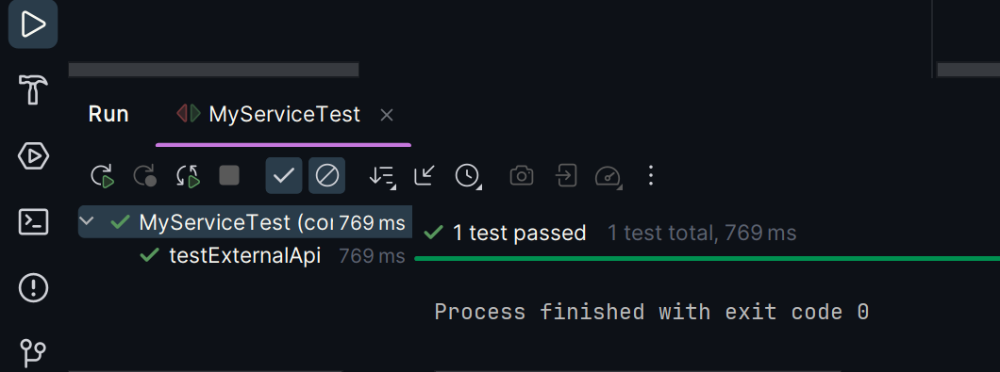

# Exercise 1: Mocking and Stubbing

### Scenario:
- Test a service that depends on an external API. Use Mockito to mock the
  external API and stub its methods.

### src:
- 🔗 [MyServiceTest.java](./src/test/java/com/kunal/MyServiceTest.java)

### output:
- 