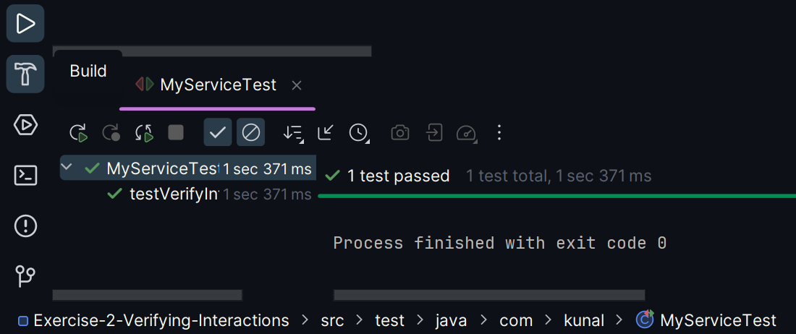

# Exercise 2: Verifying Interactions

### Scenario:
- To ensure that a method is called with specific arguments.

### src:
- 🔗 [MyServiceTest.java](./src/test/java/com/kunal/MyServiceTest.java)

### output:
- 