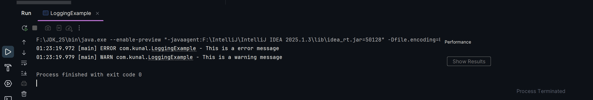

# Exercise 1: Logging Error Messages and Warning Levels

### Task:
- Write a Java application that demonstrates logging error messages and warning levels
  using SLF4J.

### src:
- 🔗 [LoggingExample.java](./src/main/java/com/kunal/LoggingExample.java)

### output:
- 