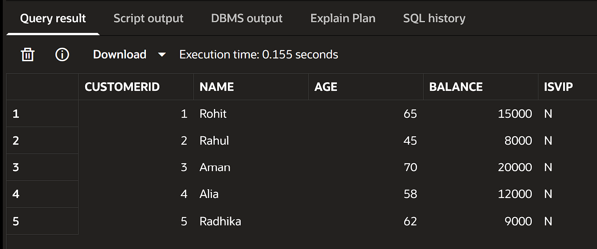
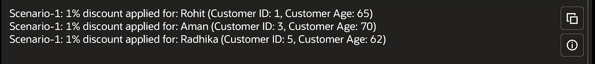

# Exercise 1: Control Structures

---

🔗 Codebase: [bank.sql](./src/bank.sql)

### Scenario 1: The bank wants to apply a discount to loan interest rates for customers above 60 years old.

Customers above age 60 get a 1% interest rate discount.

#### Customers Table:

#### DBMS Output:

