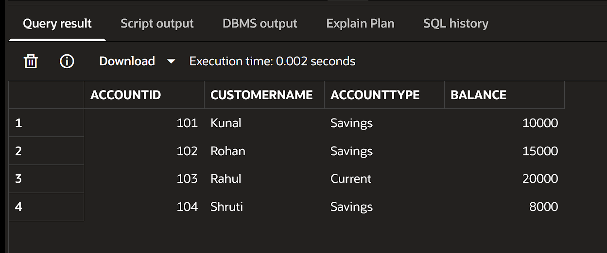
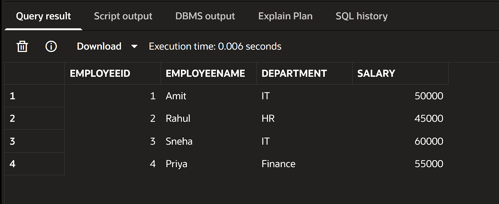
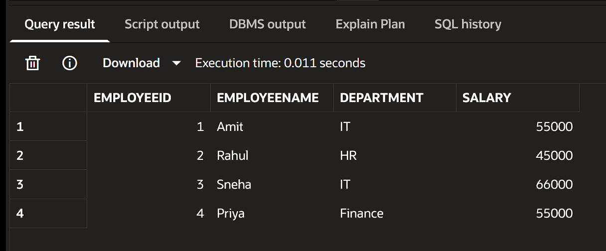
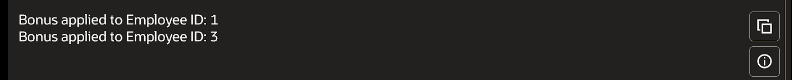
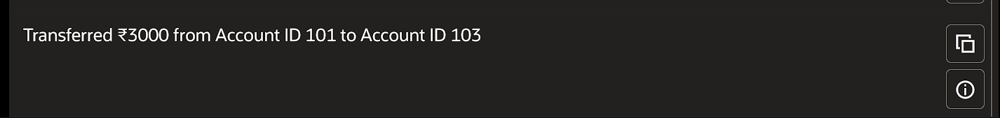
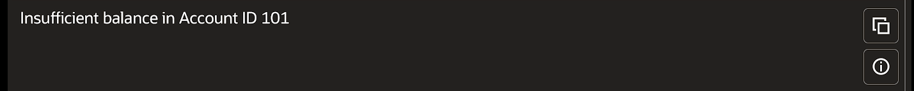

# Exercise 3: Stored Procedures

---

🔗 Codebase: [bank.sql](./src/bank.sql)

---

### Scenario 1: The bank needs to process monthly interest for all savings accounts.

Process monthly 1% interest on savings account 

#### Accounts Table:

 [Accounts Table](./output/interest_ACCOUNTS_TABLE.png)

#### DBMS Output:

---

### Scenario 2: The bank wants to implement a bonus scheme for employees based on their performance.

Adds bonus by give % to given department

#### Employees Table:

 

#### DBMS Output:

---

### Scenario 3: Customers should be able to transfer funds between their accounts.

Process to transfer funds to another account

<!-- #### Loans Table:

 -->

#### DBMS Output:

 
