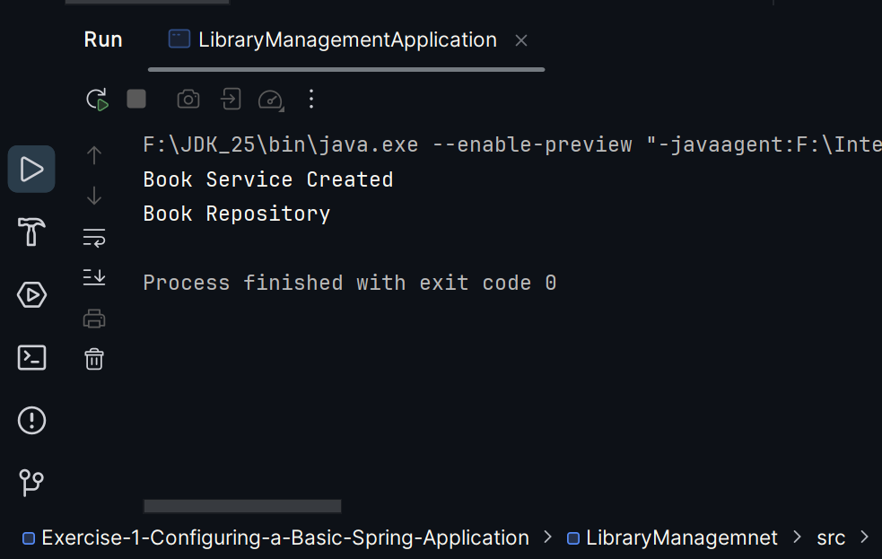

# Exercise 1: Configuring a Basic Spring Application

### Scenario:
- Develop a web application for managing a library using Spring Framework for Backend operations.

### Summary:
- Added Spring

### src:
- 🔗 [BookRepository.java](./src/test/java/com/kunal/MyServiceTest.java)
- 🔗 [BookService.java](./src/test/java/com/kunal/MyServiceTest.java)
- 🔗 [applicationContext.xml](./src/test/java/com/kunal/MyServiceTest.java)
- 🔗 [LibraryManagement.java](./src/test/java/com/kunal/MyServiceTest.java)

### output:
- 