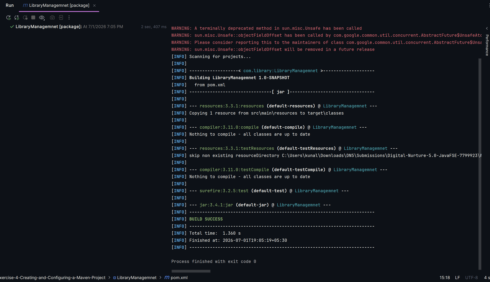
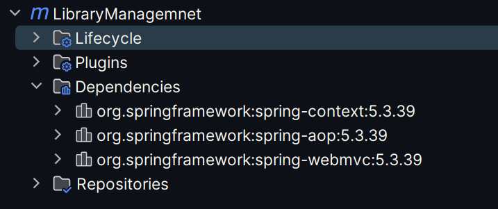

# Exercise 4: Creating and configuring Maven project

### Scenario:
- Set up a new Maven project for the library management application and add Spring dependencies.

### Summary:
- Created LibraryManagement Spring Maven based application
- Added Spring AOP and WebMVC dependencies
- Configured the Maven Compiler Plugin for Java version 1.8 in the pom.xml file.

### src:
- 🔗 [pom.xml](../Exercise-4-Creating-and-Configuring-a-Maven-Project/LibraryManagemnet/pom.xml)

### output:
- 
- 