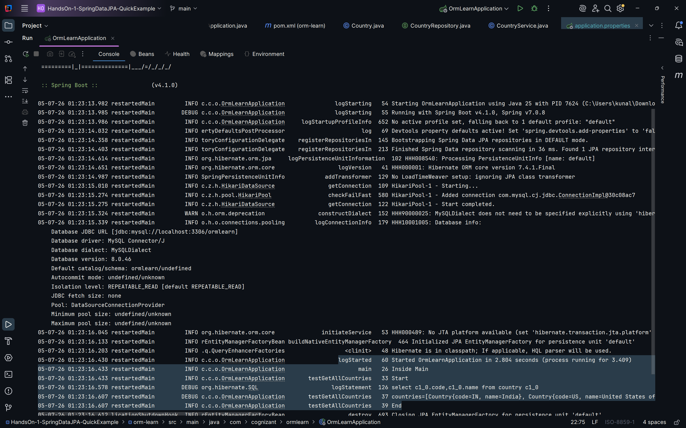

# HandsOn 1: Spring Data JPA - Quick Example

### Scenario:
- This exercise demonstrates a simple Spring Boot application using Spring Data JPA.

### Summary:
- Created orm-learn SpringBoot JPA project
- Added dependencies Spring Boot DevTools, Spring Data JPA, MySQL Driver
- Configured MySQL database connection using SpringData JPA and Hibernate

### src:
- 🔗 [application.properties](../HandsOn-1-SpringDataJPA-QuickExample/orm-learn/src/main/resources/application.properties)
- 🔗 [Country.java](../HandsOn-1-SpringDataJPA-QuickExample/orm-learn/src/main/java/com/cognizant/ormlearn/model/Country.java)
- 🔗 [CountryRepository.java](../HandsOn-1-SpringDataJPA-QuickExample/orm-learn/src/main/java/com/cognizant/ormlearn/repository/CountryRepository.java)
- 🔗 [CountryService.java](../HandsOn-1-SpringDataJPA-QuickExample/orm-learn/src/main/java/com/cognizant/ormlearn/service/CountryService.java)
- 🔗 [OrmLearnApplication.java](../HandsOn-1-SpringDataJPA-QuickExample/orm-learn/src/main/java/com/cognizant/ormlearn/OrmLearnApplication.java)

### output:
- 
