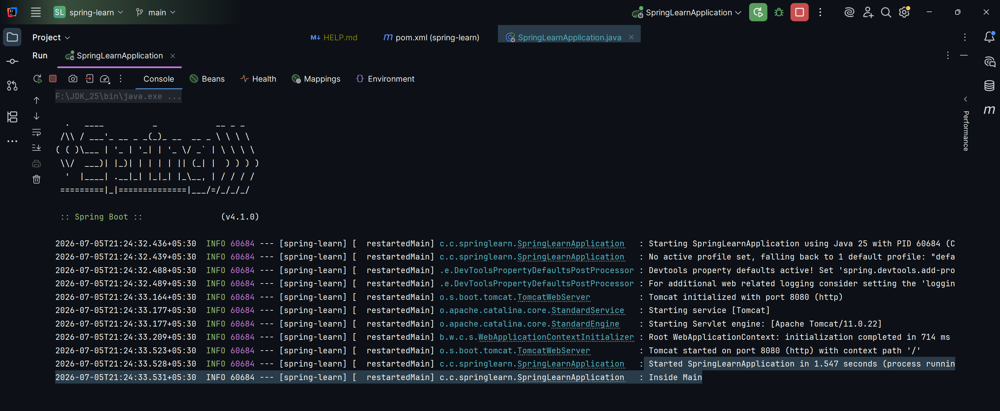

# HandsOn 1: Create a Spring Web Project using Maven

### Summary:
- Created spring-learn SpringBoot Web project
- Added dependencies Spring Boot DevTools, Spring Web
- Verifying application startup using SLF4J logging.

### src:
- 🔗 [SpringLearnApplication.java](./spring-learn/src/main/java/com/cognizant/springlearn/SpringLearnApplication.java)

### output:
- 