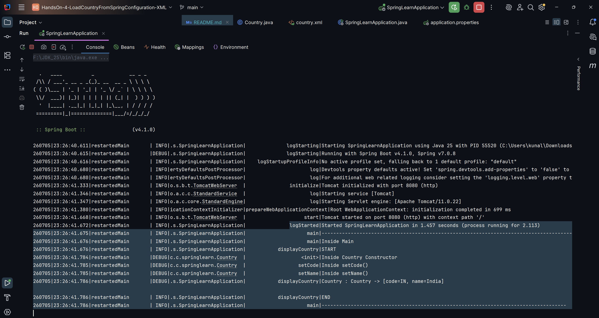

# HandsOn 4: Spring Core - Load Country from Spring configuration XML

### Summary:
- Created Country bean using Spring XML configuration
- Retrieved and displayed bean with getBean() method

### src:
- 🔗 [SpringLearnApplication.java](./spring-learn/src/main/java/com/cognizant/springlearn/SpringLearnApplication.java)
- 🔗 [Country.java](./spring-learn/src/main/java/com/cognizant/springlearn/Country.java)

### output:
- 