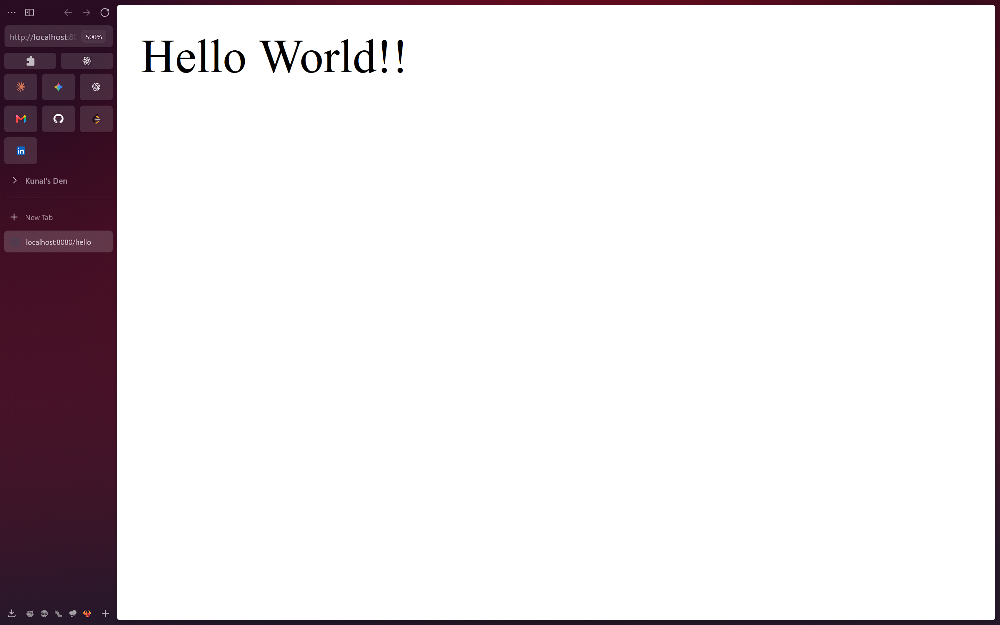
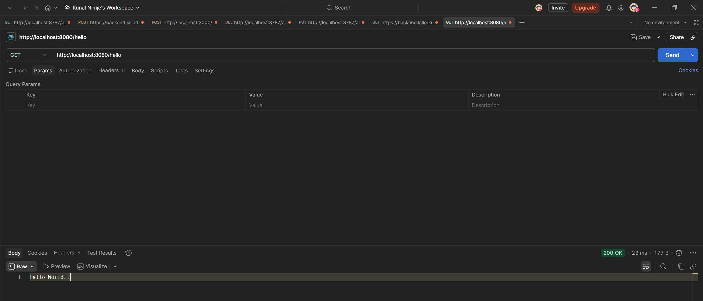
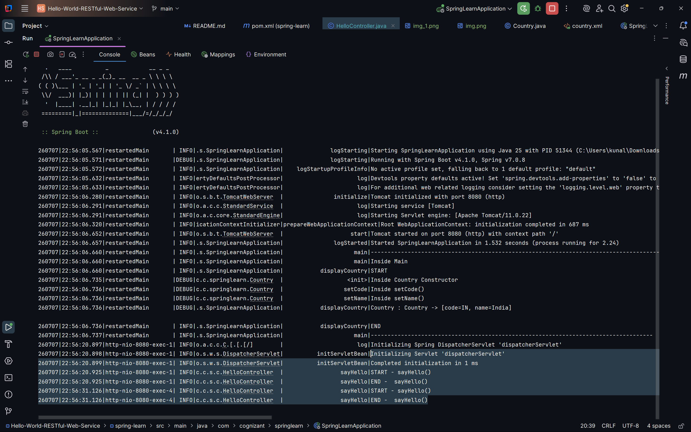

# Hello World RESTful Web Service

### Summary:
- Created a REST Controller using `@RestController`
- Added GET endpoint `/hello` using `@GetMapping`
- Verified results in browser and postman 

### src:
- 🔗 [SpringLearnApplication.java](./spring-learn/src/main/java/com/cognizant/springlearn/SpringLearnApplication.java)
- 🔗 [HelloController.java](./spring-learn/src/main/java/com/cognizant/springlearn/controller/HelloController.java)

### Browser output:
- 
### Postman output:
- 
### output logs:
- 