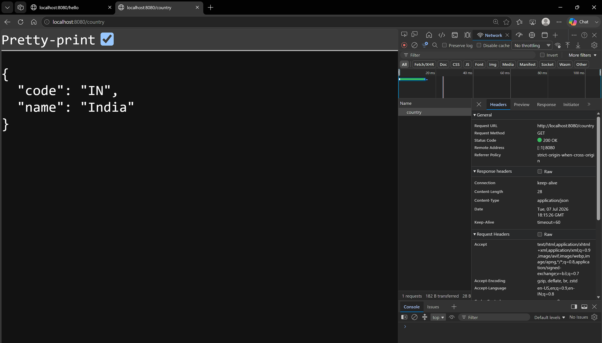
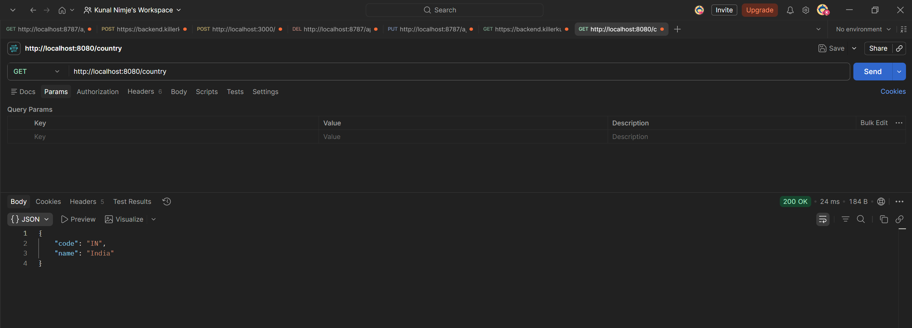
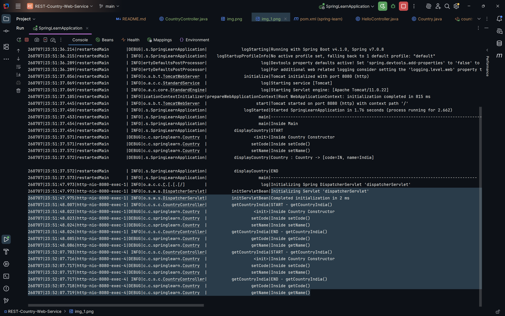

# REST - Country Web Service

### Summary:
- Created a REST endpoint `/country` using `@RestController` and `@RequestMapping`
- Returned JSON response of Country object
- Verified results in browser and postman 

### src:
- 🔗 [SpringLearnApplication.java](./spring-learn/src/main/java/com/cognizant/springlearn/SpringLearnApplication.java)
- 🔗 [CountryController.java](./spring-learn/src/main/java/com/cognizant/springlearn/controller/CountryController.java)

### Browser output:
- 
### Postman output:
- 
### output logs:
- 