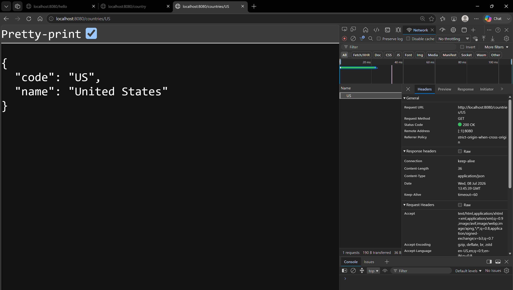
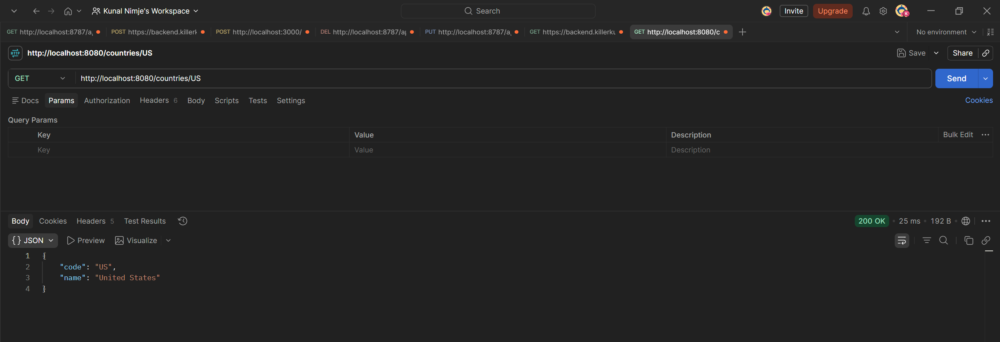
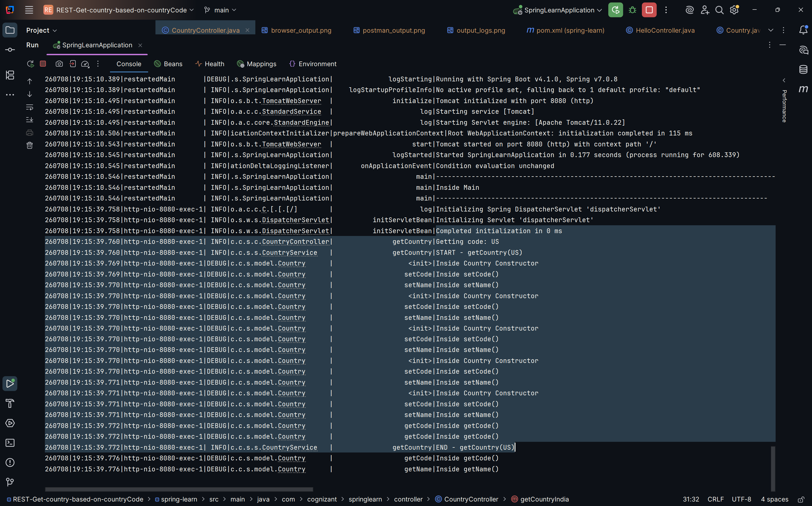

# REST - Get country based on country code

### Summary:
- Used `@GetMapping`, `@PathVariable`, `@Service`, and `@Autowired` to implement the service
- Loaded a list of countries from `country.xml` {case-insensitive}
- Implemented a REST API to fetch a country by its country code

### src:
- 🔗 [SpringLearnApplication.java](./spring-learn/src/main/java/com/cognizant/springlearn/SpringLearnApplication.java)
- 🔗 [CountryController.java](./spring-learn/src/main/java/com/cognizant/springlearn/controller/CountryController.java)
- 🔗 [CountryService.java](./spring-learn/src/main/java/com/cognizant/springlearn/service/CountryService.java)
- 🔗 [Country.java](./spring-learn/src/main/java/com/cognizant/springlearn/model/Country.java)

### Browser output:
- 
### Postman output:
- 
### output logs:
- 