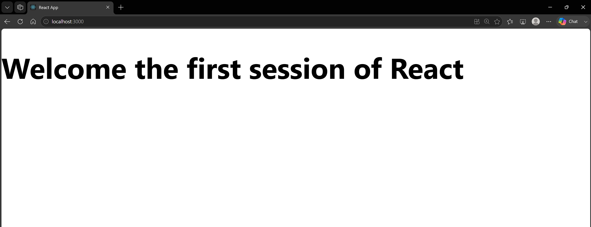

# 1. ReactJS-HOL

### Summary:
- Created a React application named myfirstreact using Create React App
- Modified App.js to display "Welcome to the first session of React" as a heading

### src:
- 🔗 [App.js](./myfirstreact/src/App.js)
- 🔗 [output.png](./output.png)

### Browser output:
- 