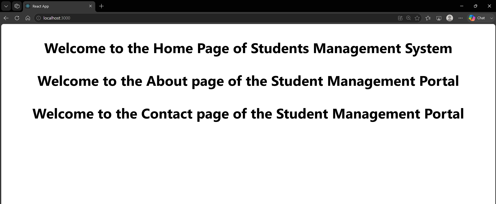

# 2. ReactJS-HOL

### Summary:
- Created a React application named StudentApp using Create React App
- Implemented three class components (Home, About, and Contact) to display different welcome messages
- Rendered all components from App.js

### src:
- 🔗 [App.js](./studentapp/src/App.js)
- 🔗 [output.png](./output.png)

### Browser output:
- 