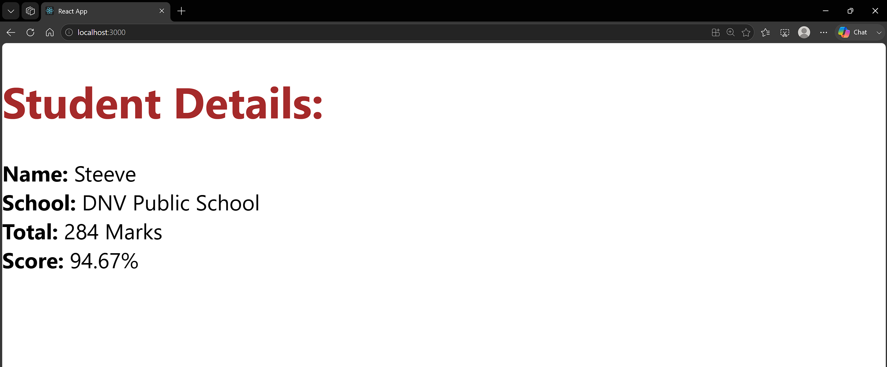

# 3. ReactJS-HOL

### Summary:
- Created a React application named scorecalculatorapp
- Implemented a functional component (CalculateScore) that accepts props and calculates the student's score percentage
- Applied CSS styling

### src:
- 🔗 [App.js](./scorecalculatorapp/src/App.js)
- 🔗 [output.png](./output.png)

### Browser output:
- 