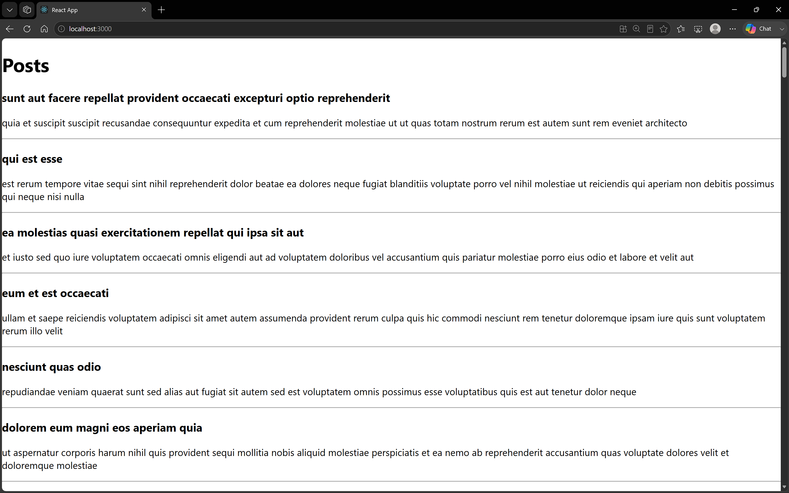

# 4 . ReactJS-HOL

### Summary:
- Created a React application named blogapp
- Implemented a class component that fetches blog posts from a REST API using componentDidMount()

### src:
- 🔗 [App.js](./blogapp/src/App.js)
- 🔗 [output.png](./output.png)

### Browser output:
- 