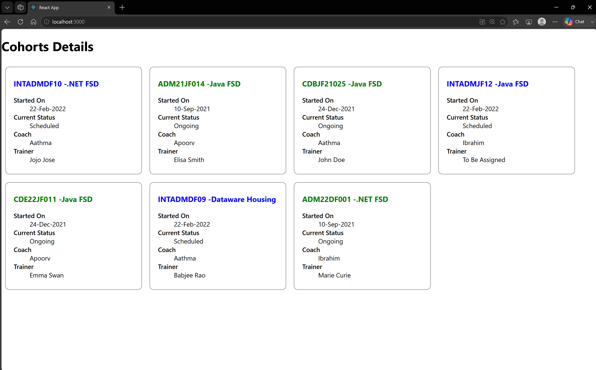

# 5. ReactJS-HOL

### Summary:
- Styled a react component
- Defined styles using the CSS Module
- Applied styles to components using className and style properties

### src:
- 🔗 [CohortDetails.module.css](./cohorttracker/src/CohortDetails.module.css)
- 🔗 [CohortDetails.js](./cohorttracker/src/CohortDetails.js)
- 🔗 [output.png](./output.png)

### Browser output:
- 