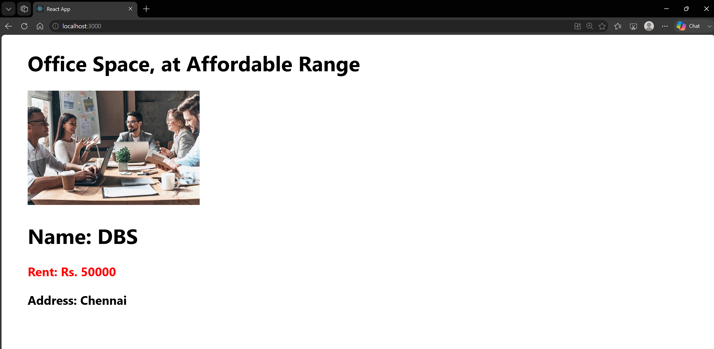

# 10. ReactJS-HOL

### Summary:
- Created a React application using JSX to display office space details
- Used objects, arrays, and map() to render multiple office spaces dynamically
- Applied inline CSS to display rent in red or green based on the rent amount

### src:
- 🔗 [App.js](./officespacerentalapp/src/App.js)
- 🔗 [output.png](./output.png)

### Browser output:
- 