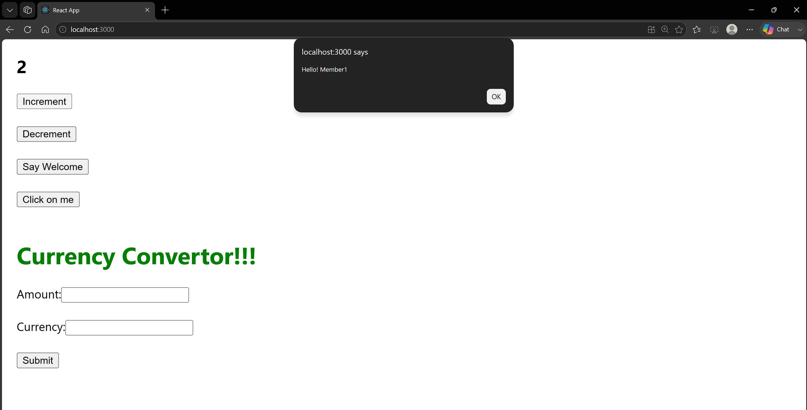
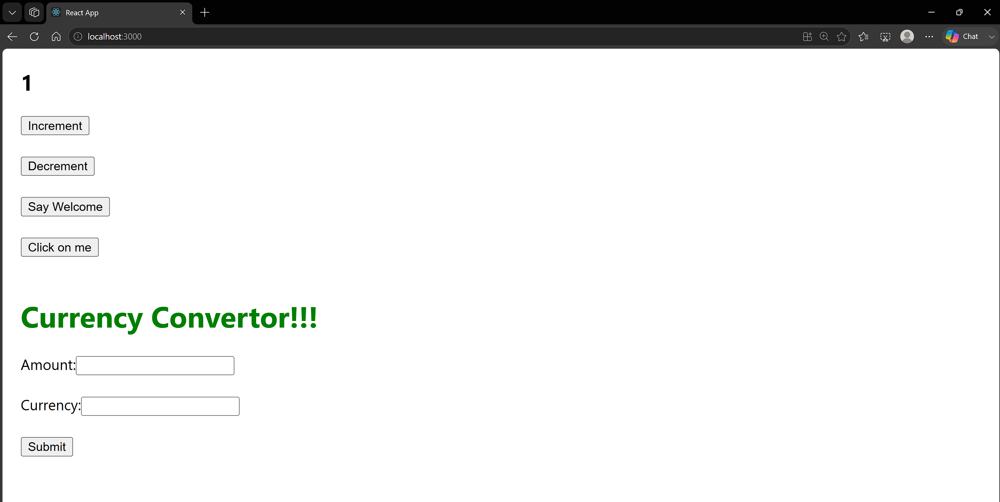
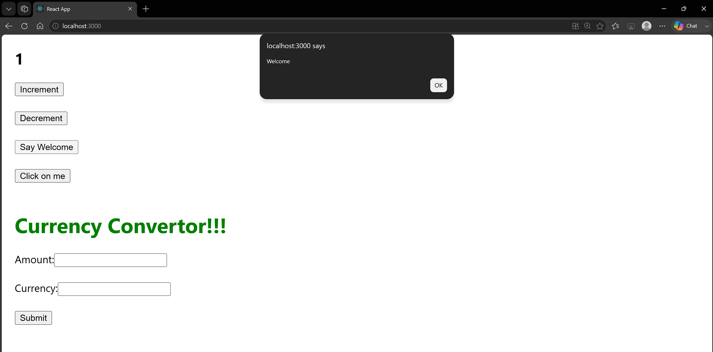
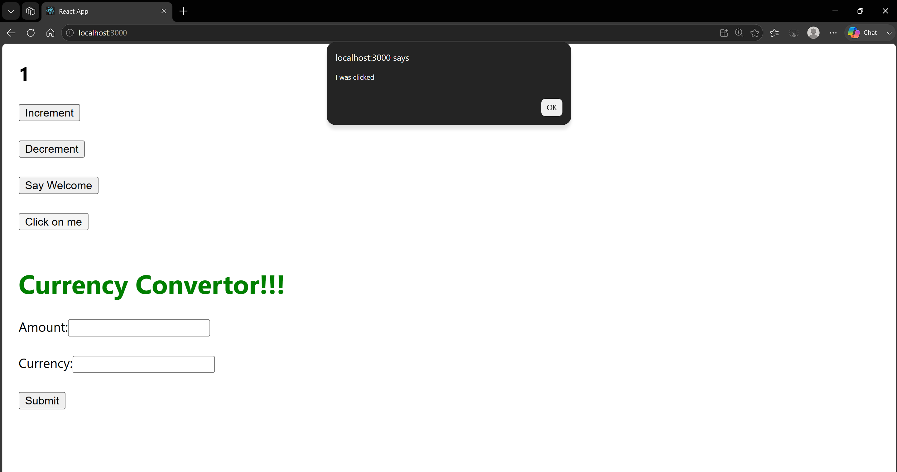
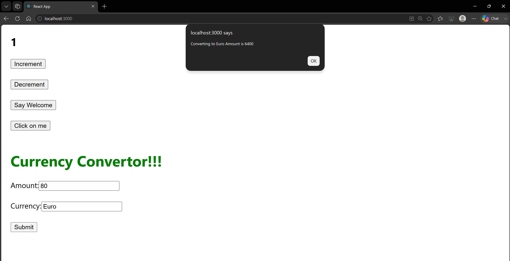

# 11. ReactJS-HOL

### Summary:
- Implemented React event handling using button click events
- Created a counter with increment/decrement functionality and multiple event handlers
- Developed a Currency Converter component to convert Indian Rupees to Euro on form submission

### src:
- 🔗 [App.js](./eventexamplesapp/src/App.js)
- 🔗 [CurrencyConvertor.js](./eventexamplesapp/src/CurrencyConvertor.js)

### Browser output:
- 
- 
- 
- 
- 