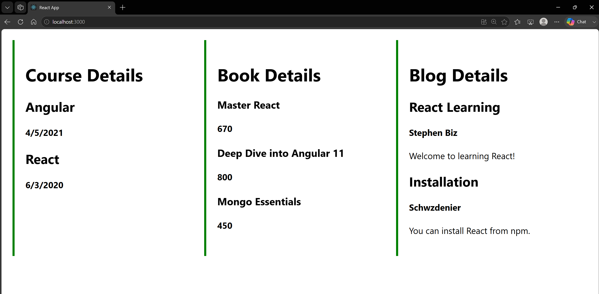

# 13. ReactJS-HOL

### Summary:
- Created a React application with Book, Blog, and Course components
- Rendered lists dynamically using map() and unique keys

### src:
- 🔗 [App.js](./ticketbookingapp/src/App.js)
- 🔗 [BlogDetails.js](./ticketbookingapp/src/App.js)
- 🔗 [BookDetails.js](./ticketbookingapp/src/App.js)
- 🔗 [CourseDetails.js](./ticketbookingapp/src/App.js)
- 🔗 [Data.js](./ticketbookingapp/src/App.js)

### Browser output:
- 