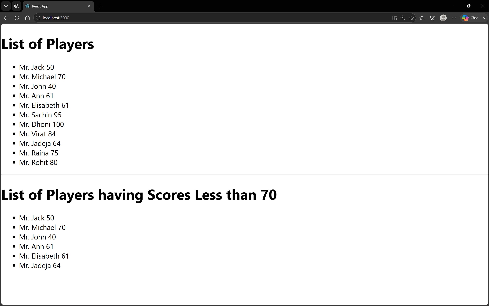

# 9. ReactJS-HOL

### Summary:
- Implemented ES6 features including map(), arrow functions, destructuring, and the spread operator
- Displayed player lists, filtered scores, odd/even players, and merged player arrays using React components

### src:
- 🔗 [ListofPlayers.js](./cricketapp/src/ListofPlayers.js)
- 🔗 [IndianPlayers.js](./cricketapp/src/IndianPlayers.js)
- 🔗 [output.png](./output.png)

### Browser output:
- 